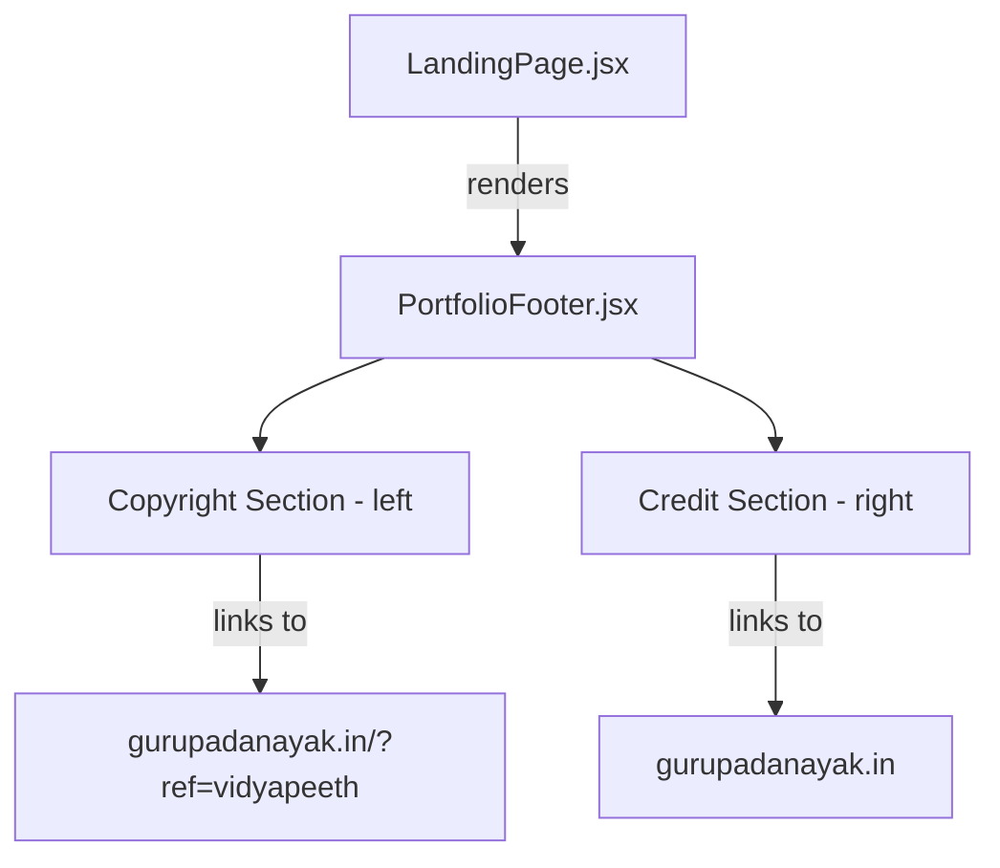

# Design Document: Portfolio Footer

## Overview

This feature replaces the existing landing page footer (which shows a Vidyapeeth copyright and contact email) with a portfolio-style footer that credits and links to the developer's personal portfolio site (gurupadanayak.in). The new footer is a standalone, reusable React component (`PortfolioFooter`) with a permanently dark theme, two-section layout, and responsive stacking behavior.

**Key design decisions:**
- The footer is extracted as a standalone component (`PortfolioFooter.jsx`) rather than inlined in LandingPage, enabling reuse on other public pages.
- The dark background is hardcoded via Tailwind utility classes (not dependent on the app's dark-mode toggle), satisfying the "always dark" requirement.
- All links use `target="_blank"` and `rel="noopener noreferrer"` for security.
- The component uses semantic HTML (`<footer>`) and ARIA labels for accessibility.

## Architecture

The footer sits at the view layer only — it has no state, no API calls, and no context dependencies. It's a pure presentational component.



**Integration point:** `LandingPage.jsx` imports and renders `<PortfolioFooter />` in place of its current inline `<footer>` block. No props are required — the component is fully self-contained.

## Components and Interfaces

### PortfolioFooter Component

| Aspect | Detail |
|--------|--------|
| File | `frontend/src/components/PortfolioFooter.jsx` |
| Props | None (stateless, self-contained) |
| Exports | Default export: `PortfolioFooter` React component |
| Renders | `<footer>` with two child sections |

**Internal structure:**

```jsx
<footer className="border-t border-slate-700 bg-slate-900">
  <div className="mx-auto flex max-w-6xl flex-col items-start justify-between gap-4 px-4 py-8 sm:flex-row sm:items-center">
    {/* Copyright Section (left) */}
    <p>
      © 2026 <a href=".../?ref=vidyapeeth">Gurupada Nayak</a>. Made with ♥ in India
    </p>
    {/* Credit Section (right) */}
    <a href="https://gurupadanayak.in">
      Crafted by <span className="text-amber-400">GurupadaNayak</span> →
    </a>
  </div>
</footer>
```

### Modified File: LandingPage.jsx

The existing inline `<footer>` block (lines ~210–222) is replaced with:

```jsx
import PortfolioFooter from '../components/PortfolioFooter';
// ...
<PortfolioFooter />
```

No other changes to LandingPage are needed.

## Data Models

No data models are required. The footer is purely presentational with hardcoded content:

| Constant | Value |
|----------|-------|
| Portfolio URL | `https://gurupadanayak.in` |
| Referral URL | `https://gurupadanayak.in/?ref=vidyapeeth` |
| Copyright text | `© 2026 Gurupada Nayak. Made with ♥ in India` |
| Credit text | `Crafted by GurupadaNayak →` |
| Background | `bg-slate-900` (always dark) |
| Text color | `text-slate-300` (light gray) |
| Accent color | `text-amber-400` (gold/yellow for developer name) |
| Border | `border-t border-slate-700` |

## Error Handling

This component has no error states — it renders static content with no network calls, user input, or dynamic data. If the component fails to render (e.g., import error), React's default error boundary behavior applies at the page level.

## Testing Strategy

### Why Property-Based Testing Does Not Apply

This feature is a static UI component with:
- No dynamic inputs or variable behavior
- Hardcoded content (URLs, text, colors)
- No transformation logic, parsing, or serialization
- No meaningful input space to explore

Running 100+ iterations of any test would not find more bugs than a single run. All acceptance criteria are best verified with example-based unit tests.

### Unit Testing Approach

**Framework:** Vitest + React Testing Library (already configured in the project)

**Test file:** `frontend/src/components/PortfolioFooter.test.jsx`

Tests to implement:

1. **Semantic structure** — Renders a `<footer>` element (Req 5.1)
2. **Copyright text** — Contains "© 2026 Gurupada Nayak. Made with ♥ in India" (Req 3.1)
3. **Copyright link href** — "Gurupada Nayak" links to `https://gurupadanayak.in/?ref=vidyapeeth` (Req 3.3)
4. **Copyright link attributes** — Has `target="_blank"` and `rel="noopener noreferrer"` (Req 3.4, 3.5)
5. **Copyright link accessibility** — Has an `aria-label` describing the destination (Req 5.2)
6. **Credit text** — Contains "Crafted by GurupadaNayak →" (Req 4.1)
7. **Credit link href** — Links to `https://gurupadanayak.in` (Req 4.4)
8. **Credit link attributes** — Has `target="_blank"` and `rel="noopener noreferrer"` (Req 4.5, 4.6)
9. **Credit link accessibility** — Has an `aria-label` describing the destination (Req 5.3)
10. **Gold highlight** — Developer name has `text-amber-400` class (Req 4.2)
11. **Dark background** — Footer has `bg-slate-900` class (Req 2.1)
12. **Top border** — Footer has `border-t` class (Req 2.3)
13. **Responsive classes** — Container has `flex-col` and `sm:flex-row` for responsive stacking (Req 1.3)

### Integration Check

Verify in `LandingPage.test.jsx` that the portfolio footer renders on the landing page and the old footer is no longer present (Req 6.1, 6.2).

### Accessibility Audit

Contrast ratio (Req 5.4) is verified by color choice:
- `text-slate-300` (#cbd5e1) on `bg-slate-900` (#0f172a) → contrast ratio ~10.5:1 ✓
- `text-amber-400` (#fbbf24) on `bg-slate-900` (#0f172a) → contrast ratio ~10.2:1 ✓

Both exceed the 4.5:1 WCAG AA requirement. This can additionally be validated with an axe-core accessibility audit.
