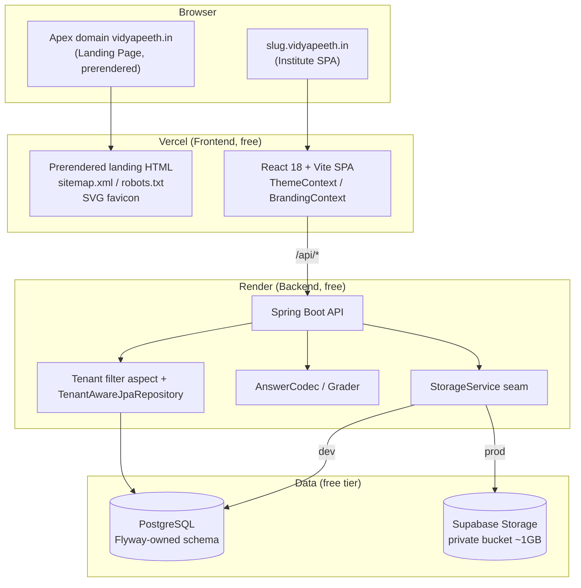
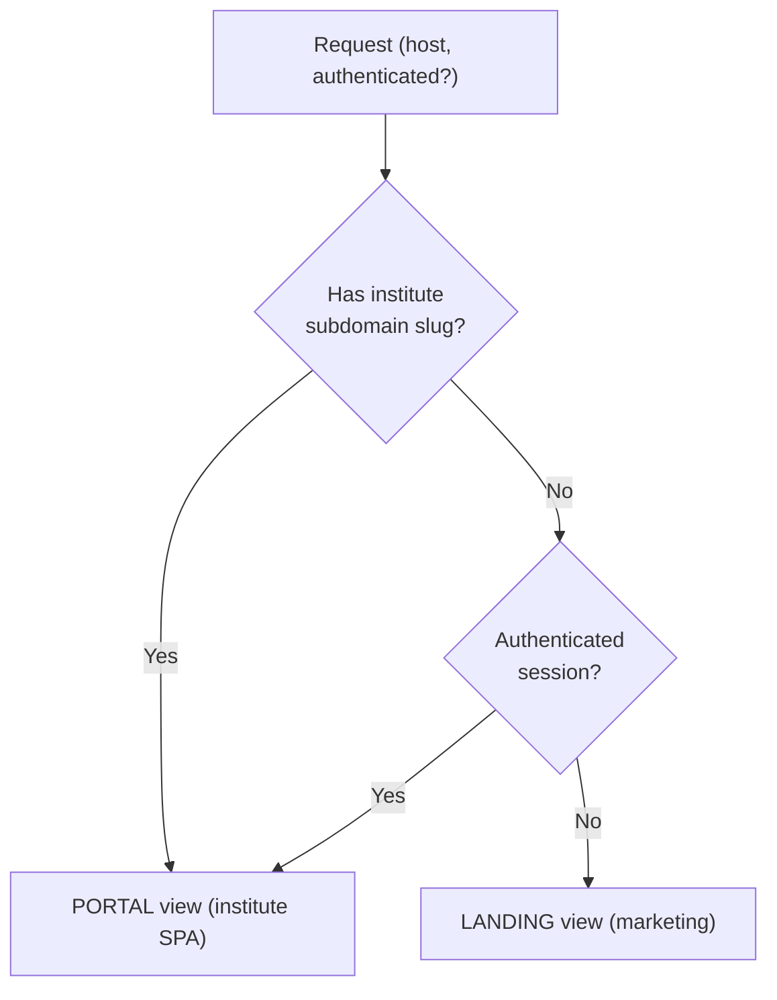
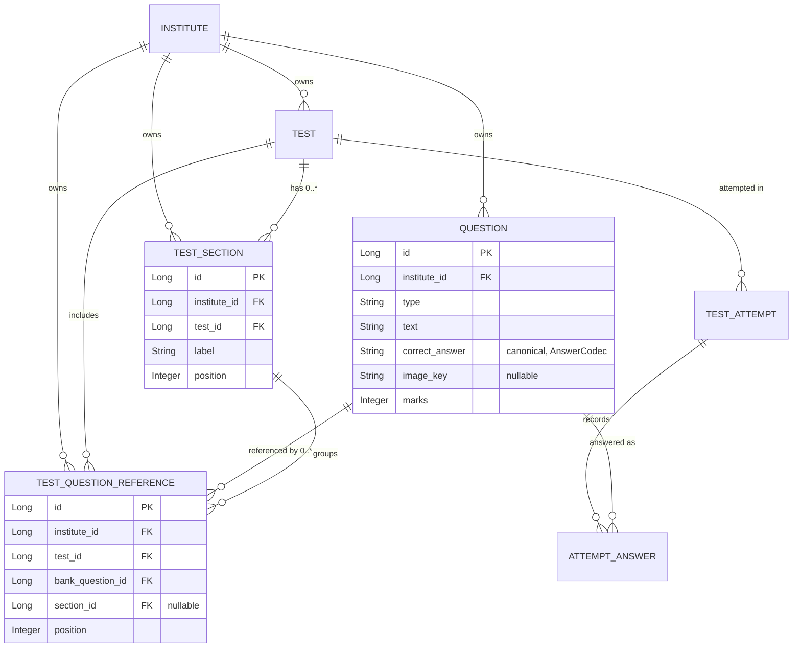

# Design Document

## Overview

Vidyapeet V2 delivers two tracks of work on top of the existing multi-tenant coaching-center SaaS without disturbing the three platform invariants (tenant isolation, `AnswerCodec` grading, Flyway-owned schema) or leaving the free tier.

- **Track A — Marketing & UI:** a code-based SVG brand logo, a public SEO-friendly landing page served only at the apex domain, and a persistent dark mode (client-side for guests, server-persisted for logged-in users).
- **Track B — Exam engine:** question images stored via the existing `StorageService` seam, a per-institute reusable question bank with reuse-by-reference, and labeled test sections under a single overall timer.

The guiding design principle is **minimal disturbance to invariant-critical code**. The `AnswerCodec`, `Grader`, `TenantBaseEntity`/`@Filter` machinery, and `TenantAwareJpaRepository` are reused as-is. Every schema change ships as a new Flyway migration (`V5`, `V6`, `V7`, `V8`) and the prod profile keeps `ddl-auto=validate`. New tenant-scoped tables extend `TenantBaseEntity` so they inherit the `institute_id` discriminator, the `@Filter`, and the auto-stamping entity listener for free.

### Design decisions at a glance

| Concern | Decision | Rationale |
|---|---|---|
| Reuse-by-reference | Repurpose the existing `questions` table as the **Question Bank** (drop `test_id`), add a `test_question_references` join table | Preserves `question.id`, so `attempt_answers.question_id` and grading stay intact; keeps `AnswerCodec` usage unchanged |
| Sections | New `test_sections` table + `section_id`/`position` on the reference row | Sections are organizational only; the reference already models "question-in-test" so section belongs there |
| Question images | Add `image_key` column on the bank question; widen the `StorageService` contract to accept images | Reuses the private-bucket streaming pattern already proven for PDFs |
| Overall timer | Keep the existing `startedAt + durationMinutes` deadline; sections add no timing | Requirement 7.4 forbids per-section limits |
| Theme persistence | New `theme_preference` column on `users`; surfaced through `UserSummary`/`/api/auth/me` | `users` is already loaded on every session bootstrap; no extra round-trip |
| Landing page | Apex-only React route + build-time prerender of that one route; static `sitemap.xml`/`robots.txt` | SEO needs crawlable HTML without paid SSR hosting |
| Brand logo | Inline SVG React component using `currentColor` | Scales losslessly, adapts to light/dark, never overrides `--brand` |

## Architecture

### System context



### Where V2 changes land

- **Frontend (Track A + B UI):** new `BrandLogo` component, `ThemeContext` provider, `LandingPage` route with apex detection, section-grouped take-test/editor views, and question-image rendering in editor/take/result views.
- **Backend (Track B + theme):** new `bank`/`section` entities and services in the `exam` package, an `image` upload/download controller, a theme field on `User`, and four new Flyway migrations.
- **Untouched invariant code:** `AnswerCodec`, `Grader`, `TenantContext`/`TenantFilterAspect`/`TenantEntityListener`, `TenantAwareJpaRepository`, `JpaConfig`.

### Request-view resolution (Track A)

Apex-vs-portal is a pure decision over `(hostname, authenticated)`. Today `getTenantSlug()` already returns `null` on the bare apex. V2 formalizes a `resolveView(host, isAuthenticated)` helper so the routing rule is unit/property-testable:



## Components and Interfaces

### Track A — Brand logo

- **`BrandLogo` (React component)** in `frontend/src/components/BrandLogo.jsx`.
  - Props: `variant` (`'full' | 'icon' | 'wordmark'`), `className`.
  - Renders inline `<svg>` markup. Foreground uses `currentColor` (driven by the surrounding Tailwind text color / `dark:` variant) so the logo is legible in both appearances; it does **not** set `--brand`/`--brand-dark`, so institute brand theming is preserved.
  - Used in `PortalLayout` header, on the `LandingPage`, and exported as the SVG favicon (`frontend/public/favicon.svg`, referenced from `index.html`).
- **Default-branding fallback:** `BrandingContext` already falls back to `DEFAULT_BRANDING` with `logoUrl: null`. Consuming components render `<BrandLogo />` whenever `branding.logoUrl` is absent.

### Track A — Landing page & SEO

- **`LandingPage` (React route)** in `frontend/src/pages/LandingPage.jsx`.
  - Rendered by `App` only when `resolveView(host, isAuthenticated) === 'LANDING'`. Institute subdomains and authenticated sessions never see it.
  - Uses semantic landmarks (`<header>`, `<nav>`, `<main>`, `<section>`, `<footer>`), marketing copy (who/what/features, long-tail phrase "mock test platform for coaching institutes"), a **student sign-up** control (posts to the existing `POST /api/auth/register`) and a **log-in** control (existing `POST /api/auth/login`, all roles). No institute self-sign-up. Footer shows `vidyapeeth.in@gmail.com`.
- **SEO assets:**
  - `<title>`, meta description (brand term "vidyapeeth"), Open Graph tags (title/description/type/url/image), and JSON-LD (`Organization` + `SoftwareApplication`) injected into the landing markup.
  - Static `frontend/public/sitemap.xml` (apex landing URL only) and `frontend/public/robots.txt` (allow landing, disallow `/admin`, `/student`, `/superadmin`, `/login` app routes).
  - **Prerenderer:** a build-time prerender step (Vite build plugin such as `vite-plugin-prerender`/`vite-react-ssg`, run only for the landing route) emits crawlable static HTML for the apex so primary marketing content is present without client-side JS. Authenticated app routes are excluded from prerendering and from the sitemap.

### Track A — Dark mode

- **`ThemeContext`** in `frontend/src/theme/ThemeContext.jsx`, wrapping `App` above `BrandingContext`.
  - Resolution order for the active theme: logged-in user's persisted `themePreference` → `localStorage.theme` → `prefers-color-scheme`.
  - Applies/removes the `dark` class on `document.documentElement` (Tailwind `darkMode: 'class'`). Never mutates `--brand`/`--brand-dark`.
  - Guests: writes selection to `localStorage`. Logged-in users: writes to `localStorage` **and** calls the theme endpoint.
- **`Theme_Service` (backend):** theme preference stored on `users.theme_preference`.
  - `PUT /api/auth/me/theme` (authenticated) — body `{ "theme": "LIGHT" | "DARK" }`; persists against the current user.
  - `UserSummary` record gains a `themePreference` field, returned by `GET /api/auth/me`.
- **Tailwind:** set `darkMode: 'class'` and add `dark:` variants across existing components.

### Track B — Question images

- **`StorageService` contract widened** to accept images alongside PDFs. Instead of hard-coding `application/pdf`, `store` accepts an allowed-content-type policy. Design: add `String store(MultipartFile file, Set<String> allowedContentTypes, long maxBytes)` and keep the existing `store(file)` delegating with the PDF policy, so existing library/notes callers are untouched. Image policy: `image/png`, `image/jpeg`, `image/webp`; per-image cap (e.g. 2 MB) to protect the Supabase budget. The stored key extension is derived from the content type.
- **Endpoints** on a new `QuestionImageController` (`INSTITUTE_ADMIN` for upload/delete; authenticated for download), mirroring `LibraryController`'s streaming pattern:
  - `POST /api/questions/{questionId}/image` (multipart) → validates type/size, stores via `StorageService`, sets `bank_question.image_key`.
  - `GET /api/questions/{questionId}/image` → streams the file with the correct media type; tenant filter guarantees only the owning institute resolves the question.
  - `DELETE /api/questions/{questionId}/image` → clears the key and best-effort deletes the file.
- **Tenant isolation:** the bank question is a `TenantBaseEntity`, so `findById` routes through `TenantAwareJpaRepository` and the `@Filter`; an admin from another institute cannot resolve the question id and therefore cannot read or write its image.

### Track B — Reusable question bank

- **`ExamService` / new `QuestionBankService`** manage bank questions and references.
  - `questions` table becomes the **bank** (institute-scoped, no `test_id`). CRUD on a bank question edits it in place, so every referencing test reflects the change (no content copy).
  - Attaching a bank question to a test creates a `TestQuestionReference` (test_id, bank_question_id, section_id, position). The same bank question id may appear in many references across many tests.
  - Detaching removes the reference row only; the bank question remains.
  - **Answer handling stays through `AnswerCodec`** exactly as today: `applyRequest` encodes MCQ/MSQ/TRUE_FALSE/FILL_BLANK, and `Grader` compares via `AnswerCodec.isCorrect`. No new answer logic is introduced.
- **Grading path change:** `TakeTestService` resolves a test's questions by joining references → bank questions (ordered by section position then reference position) instead of `questionRepository.findByTestId`. A new `TestQuestionReferenceRepository.findResolvedQuestions(testId)` returns the ordered `Question` (bank) list. `Grader`, `GradeOutcome`, `AttemptAnswer` (keyed by `question_id` = bank question id), and DOUBLE-typed scores are unchanged.

### Track B — Timed sections

- **`TestSection` entity** (`TenantBaseEntity`): `test_id`, `label`, `position`.
- `TestQuestionReference.section_id` (nullable) + `position` records the grouping and order within the test.
- Admin endpoints (under `ExamController`/`QuestionBankService`) to create/rename/reorder/delete sections and to assign a reference to a section.
- **Timer unchanged:** `StartedTestResponse` still derives `deadline = startedAt + durationMinutes`; there are no per-section limits. When a test has no sections, references carry `section_id = null` and the frontend renders one ungrouped list; the take-test view shows the single overall timer and auto-submits at zero.

### Interface summary (new/changed)

| Endpoint | Role | Purpose |
|---|---|---|
| `PUT /api/auth/me/theme` | authenticated | Persist theme preference (Req 4.4) |
| `GET /api/auth/me` (changed) | authenticated | Now includes `themePreference` (Req 4.5) |
| `POST/GET/DELETE /api/questions/{id}/image` | admin / auth / admin | Question image lifecycle (Req 5) |
| `POST/GET/DELETE /api/tests/{id}/sections` | admin | Section management (Req 7) |
| `POST/DELETE /api/tests/{id}/references` | admin | Attach/detach bank questions (Req 6.2, 6.9) |
| `GET/POST/PUT/DELETE /api/bank/questions` | admin | Question bank CRUD (Req 6.1, 6.4) |

## Data Models

### New and changed tables (Flyway migrations)

Migrations continue the existing numbering and PostgreSQL style (`BIGINT GENERATED ALWAYS AS IDENTITY`, `institute_id` FK, `created_at TIMESTAMPTZ`, indexed `institute_id`). Suggested ordering matches the build order.

**V5 — user theme preference (Track A)**
```sql
ALTER TABLE users ADD COLUMN theme_preference VARCHAR(8) NOT NULL DEFAULT 'LIGHT';
```

**V6 — question images (Track B)**
```sql
ALTER TABLE questions ADD COLUMN image_key VARCHAR(255);
```

**V7 — reusable question bank (Track B)**
```sql
-- Repurpose `questions` as the per-institute bank: it no longer belongs to one test.
CREATE TABLE test_question_references (
    id               BIGINT GENERATED ALWAYS AS IDENTITY PRIMARY KEY,
    institute_id     BIGINT      NOT NULL REFERENCES institutes (id),
    test_id          BIGINT      NOT NULL REFERENCES tests (id),
    bank_question_id BIGINT      NOT NULL REFERENCES questions (id),
    section_id       BIGINT,     -- FK added in V8; null = ungrouped
    position         INT         NOT NULL DEFAULT 0,
    created_at       TIMESTAMPTZ NOT NULL,
    CONSTRAINT uk_test_question_ref UNIQUE (test_id, bank_question_id)
);
CREATE INDEX idx_tqr_institute ON test_question_references (institute_id);
CREATE INDEX idx_tqr_test ON test_question_references (test_id);
CREATE INDEX idx_tqr_bank_question ON test_question_references (bank_question_id);

-- Backfill: every existing question becomes a reference from its current test,
-- preserving question ids (and thus attempt_answers linkage) without data loss.
INSERT INTO test_question_references (institute_id, test_id, bank_question_id, position, created_at)
SELECT institute_id, test_id, id, id, now() FROM questions;

-- The bank question no longer stores its owning test.
ALTER TABLE questions DROP COLUMN test_id;
```

**V8 — test sections (Track B)**
```sql
CREATE TABLE test_sections (
    id           BIGINT GENERATED ALWAYS AS IDENTITY PRIMARY KEY,
    institute_id BIGINT       NOT NULL REFERENCES institutes (id),
    test_id      BIGINT       NOT NULL REFERENCES tests (id),
    label        VARCHAR(255) NOT NULL,
    position     INT          NOT NULL DEFAULT 0,
    created_at   TIMESTAMPTZ  NOT NULL
);
CREATE INDEX idx_test_sections_institute ON test_sections (institute_id);
CREATE INDEX idx_test_sections_test ON test_sections (test_id);

ALTER TABLE test_question_references
    ADD CONSTRAINT fk_tqr_section FOREIGN KEY (section_id) REFERENCES test_sections (id);
```

### Entity model



### JPA entities

- **`Question` (repurposed as Bank_Question):** remove the `test_id` field; add `imageKey`. Remains `@Entity @Table(name="questions")` extending `TenantBaseEntity` with the tenant `@Filter`. All answer fields and `AnswerCodec` encoding are unchanged.
- **`TestQuestionReference`:** new `@Entity @Table(name="test_question_references")` extending `TenantBaseEntity`; fields `testId`, `bankQuestionId`, `sectionId` (nullable), `position`.
- **`TestSection`:** new `@Entity @Table(name="test_sections")` extending `TenantBaseEntity`; fields `testId`, `label`, `position`.
- **`User`:** add `themePreference` (`enum ThemePreference { LIGHT, DARK }`, `@Enumerated(STRING)`, default `LIGHT`).
- **`UserSummary`:** add `ThemePreference themePreference`.

### Repositories

All extend `JpaRepository` and therefore inherit `TenantAwareJpaRepository`'s tenant-safe `findById`/`existsById`.

- `TestQuestionReferenceRepository`: `findByTestIdOrderBySectionPositionAscPositionAsc`, `findByBankQuestionId`, `deleteByTestIdAndBankQuestionId`, plus a resolved-questions query returning ordered `Question` entities for a test.
- `TestSectionRepository`: `findByTestIdOrderByPositionAsc`.
- `QuestionRepository`: bank-oriented finders (`findByInstituteId`-style via filter, by id); existing `deleteByTestId` is replaced by reference-aware cleanup in `ExamService.deleteTest`.

## Correctness Properties

*A property is a characteristic or behavior that should hold true across all valid executions of a system—essentially, a formal statement about what the system should do. Properties serve as the bridge between human-readable specifications and machine-verifiable correctness guarantees.*

The properties below focus on the backend logic and pure helpers introduced by V2 (view resolution, question-bank reuse, grading via references, section ordering, timer derivation, storage policy, tenant isolation). UI rendering, static SEO assets, and one-time migrations are validated with example, snapshot, and smoke tests instead (see Testing Strategy).

### Property 1: Apex-vs-portal view resolution

*For any* hostname and authentication flag, `resolveView(host, authenticated)` returns `LANDING` if and only if the host is the bare apex domain (no institute subdomain, ignoring `www`) and the session is unauthenticated; for every institute-subdomain host it returns `PORTAL` regardless of authentication.

**Validates: Requirements 2.1, 2.2**

### Property 2: Student sign-up always creates a STUDENT

*For any* valid registration payload submitted from the landing page, the account created by the Auth_Service has role `STUDENT`.

**Validates: Requirements 2.8**

### Property 3: Theme preference persistence round-trip

*For any* user and any theme value in `{LIGHT, DARK}`, persisting the preference via the Theme_Service and then reloading the user's `UserSummary` from `/api/auth/me` returns the same theme value.

**Validates: Requirements 4.4, 4.5**

### Property 4: Storage type and size policy

*For any* uploaded file, `StorageService.store` accepts it if and only if its content type is in the allowed set (image types for question images, PDF for existing callers) and its size is within the configured per-file limit; disallowed types and oversized files are rejected with a descriptive error and no key is produced.

**Validates: Requirements 5.1, 5.4, 5.9, 8.4**

### Property 5: Question image association round-trip

*For any* bank question and any valid image upload, after upload the question's `image_key` equals the storage key returned by `StorageService`, and that key streams back the stored image.

**Validates: Requirements 5.2**

### Property 6: Attaching references without copying

*For any* bank question and any set of tests, attaching the question to those tests creates one `TestQuestionReference` per test that all point to the same unchanged bank question id, without creating additional bank question rows.

**Validates: Requirements 6.2, 6.3**

### Property 7: Editing a bank question reflects in every referencing test

*For any* bank question referenced by any number of tests, editing the bank question causes every referencing test to resolve the updated content (text, options, canonical correct answer, marks, image).

**Validates: Requirements 6.4**

### Property 8: Grading via referenced definitions

*For any* test whose questions are attached by reference and any set of student selections, the per-question awarded marks and the total attempt score are exactly those produced by the `Grader` over the resolved bank question definitions using `AnswerCodec`, and the resulting score is a `double` that equals the sum of awarded marks (including fractional and negative values under negative marking).

**Validates: Requirements 6.5, 6.8, 6.10, 8.2, 8.6**

### Property 9: Detaching a reference retains the bank question

*For any* bank question referenced by one or more tests, removing its reference from one test deletes only that reference row; the bank question still exists in the bank and all other references to it remain intact.

**Validates: Requirements 6.9**

### Property 10: Section grouping and ordering

*For any* test and any configuration of sections and references, resolving the test's questions yields them ordered by section position and then by reference position within each section; when the test defines no sections, resolution yields a single ungrouped list ordered by reference position.

**Validates: Requirements 7.2, 7.5, 7.8**

### Property 11: Overall timer derivation is independent of sections

*For any* test and any section configuration, the attempt deadline equals `startedAt + durationMinutes` and no per-section time limit is applied.

**Validates: Requirements 7.4**

### Property 12: Tenant isolation across all new V2 tables

*For any* two distinct institutes and any rows they own in the new tenant-scoped tables (bank questions, test-question references, test sections, and question images), an actor scoped to one institute can never read or mutate the other institute's rows — neither through repository queries nor through `findById`.

**Validates: Requirements 5.8, 6.1, 6.6, 7.9, 8.1**

## Error Handling

The design reuses the existing `Exceptions` factory and `GlobalExceptionHandler` (`ApiErrorResponse`) so error semantics stay consistent with the current API.

- **Invalid image upload (Req 5.4):** unsupported content type or oversized file → `Exceptions.badRequest(...)` with a descriptive message (e.g. "Only PNG, JPEG, or WebP images up to 2 MB are allowed."). No storage key is created.
- **Cross-tenant access (Req 5.8, 6.6, 7.9, 8.1):** the tenant `@Filter` and `TenantAwareJpaRepository.findById` make another institute's rows invisible, so lookups surface as `Exceptions.notFound(...)` rather than leaking existence.
- **Attaching a missing bank question or section:** `Exceptions.notFound(...)`; attaching a question already referenced by the test violates `uk_test_question_ref` and is surfaced as `Exceptions.conflict(...)`.
- **Publishing a test with no references:** mirrors the existing "at least one question" rule — `Exceptions.badRequest(...)` when a test has zero resolved questions.
- **Theme update with an invalid value:** validated against the `ThemePreference` enum → `Exceptions.badRequest(...)`.
- **Storage backend failure (Supabase):** wrapped as a `500` via the existing `IllegalStateException` path in `SupabaseStorageService`; question `image_key` is only set after a successful store so a failed upload leaves the question image-less.
- **Deleting a bank question still referenced by tests:** blocked with `Exceptions.conflict(...)` (detach references first) to protect existing attempts and results; deletion cascades reference cleanup only when explicitly requested.
- **Landing/prerender fallback:** if prerendered HTML is unavailable, the SPA still hydrates the landing route client-side; SEO assets degrade gracefully (crawlers get the prerendered copy, users get the SPA).

## Testing Strategy

### Dual approach

- **Property-based tests** verify the universal properties above (backend logic, pure helpers).
- **Unit / example tests** cover specific scenarios, UI rendering, and error messages.
- **Snapshot tests** cover SVG logo output and prerendered landing markup / SEO tags.
- **Integration & smoke tests** cover the Flyway migrations, `ddl-auto=validate` boot, static SEO files, and free-tier configuration.

### Property-based testing

PBT is appropriate here because the core of Track B (question-bank reuse, grading via references, section ordering, tenant isolation) and several Track A helpers (view resolution, theme persistence, storage policy) are pure functions or clear input/output logic with large input spaces.

- **Backend library:** add **jqwik** (JUnit 5 platform) as a test-scoped dependency; the project currently has no PBT library. Do **not** hand-roll generators/shrinking.
- **Frontend helper (`resolveView`, Property 1):** use **fast-check** with Vitest for the pure resolution helper.
- **Configuration:** each property test runs a **minimum of 100 iterations**.
- **Tagging:** annotate each property test with a comment in the form
  `Feature: vidyapeeth-v2-upgrades, Property {number}: {property_text}`.
- **One property, one test:** implement each of Properties 1–12 as a single property-based test.
- **Generators:** build generators for institutes, bank questions (all four `QuestionType`s with valid canonical answers), tests, sections with positions, references, student selections (correct/incorrect/blank), negative-marking configs, and uploaded files with varied content types and sizes (including boundary sizes and non-image types). Tenant-isolation properties generate two distinct institutes and assert no cross-tenant visibility via both query methods and `findById`. Storage properties use an in-memory/mock `StorageService` so the 100+ iterations never touch Supabase.

### Unit, snapshot, and example tests

- **Track A logo (Req 1.1–1.8):** component tests assert each `BrandLogo` variant renders the expected `<svg>`/sub-elements, that the header/landing render the logo, that the favicon references the SVG, and that rendering the logo leaves `--brand`/`--brand-dark` untouched. Snapshot the SVG output.
- **Landing content & SEO (Req 2.3–2.7, 3.1–3.3, 3.6, 3.8, 3.9):** render/snapshot tests assert marketing copy, the long-tail phrase, semantic landmarks, sign-up→register and login wiring, absence of institute self-sign-up, footer email, and presence of `<title>`/meta/OG/JSON-LD tags; assert app routes are absent from the sitemap.
- **Dark mode UI (Req 4.1–4.3, 4.6–4.8):** tests for toggle presence in both auth states, guest `localStorage` persistence, `prefers-color-scheme` fallback, application of server theme on load, `dark:` styling, and preservation of brand variables when dark is active.
- **Image rendering (Req 5.5–5.7):** editor/take/result views render the image when `image_key` is present.

### Integration & smoke tests

- **Migrations (Req 4.9, 5.3, 6.7, 7.3):** run V5–V8 against a PostgreSQL-mode database seeded with pre-migration data; assert the `test_question_references` backfill count equals the prior `questions` count, question ids are preserved (so `attempt_answers` linkage holds), and no questions are lost.
- **Prerender output (Req 3.4, 3.5, 3.7):** build the frontend and assert the prerendered landing HTML contains marketing content without executing JS, and that `sitemap.xml` and `robots.txt` are emitted with the correct allow/disallow rules.
- **Prod schema validation (Req 8.3):** boot the app under the `prod` profile against the migrated schema to confirm `ddl-auto=validate` passes (no drift between entities and Flyway schema).
- **Free-tier posture (Req 8.5):** smoke check that no configuration requires paid resources (single Render service, Vercel static hosting, Supabase private bucket within the size policy).
