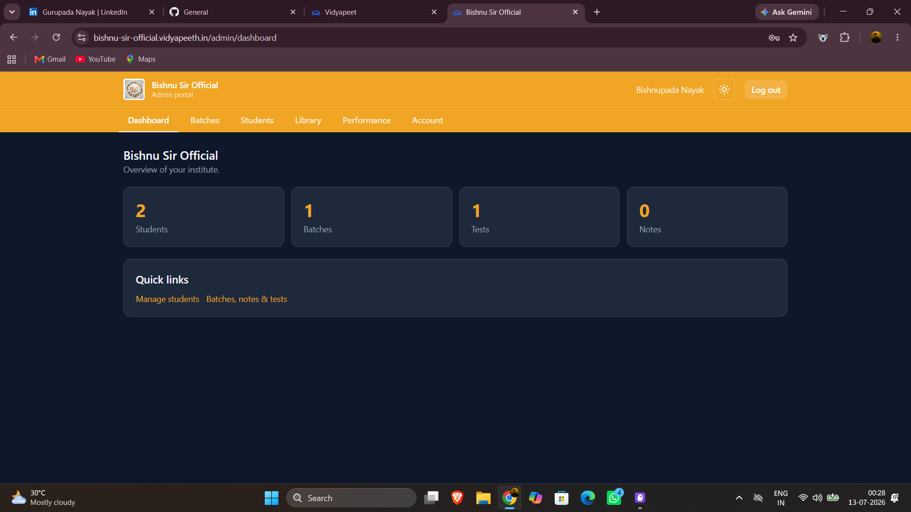
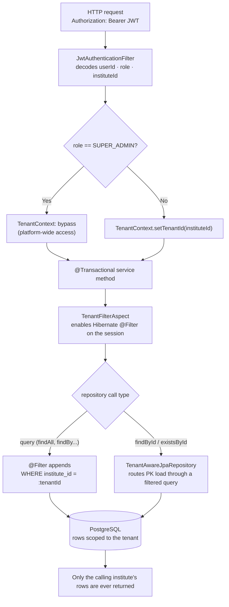

# Vidyapeeth — Multi-Tenant Exam Platform for Coaching Institutes

> **"Shopify for coaching centers."** One codebase and one database serve many coaching
> institutes (tenants). Each institute gets its own branded portal where students log in,
> read study material, and take auto-graded mock tests with per-batch leaderboards — while
> being completely isolated from every other institute's data.

🔗 **Live demo:** `[LIVE URL]` · **Try it with the demo logins below.**

---

## Highlights

- 🏢 **True multi-tenancy** — one deployment hosts unlimited institutes; a two-layer
  isolation model guarantees no institute can ever read another's data, even by guessing an ID.
- 🎨 **Per-institute branding** — each portal themes itself (logo + primary color) from the
  subdomain before login.
- 📝 **Four question types** — MCQ, MSQ (multi-select), True/False, and Fill-in-the-blank,
  all graded through a single canonical `AnswerCodec`.
- 📚 **Reusable question bank** — author a question once and reference it across many tests;
  edit it in one place and every test updates.
- ⏱️ **Timed, sectioned exams** — group questions into labeled sections under one overall
  timer, with auto-submit at zero.
- 🖼️ **Image-based questions** — attach diagrams/figures, stored securely per tenant.
- 🌙 **Persistent dark mode** — follows a logged-in user across devices.
- 🌐 **SEO-ready public landing page** — prerendered HTML, Open Graph, JSON-LD, sitemap & robots.
- ✅ **Property-based testing** — 12 correctness properties verified with 100+ generated
  cases each (jqwik on the backend, fast-check on the frontend).
- ☁️ **Runs entirely on free tiers** — Render + Vercel + Supabase.

---

## Tech stack

| Layer     | Technologies |
|-----------|--------------|
| Backend   | Java 17, Spring Boot 3.2, Spring Data JPA, Spring Security (JWT), Apache POI (Excel import), Flyway |
| Frontend  | React 18, Vite, Tailwind CSS, React Router, Axios |
| Database  | PostgreSQL (production, Flyway-managed) · H2 in-memory (local dev & tests) |
| Storage   | Supabase Storage (production) · local disk (dev), behind a `StorageService` seam |
| Testing   | JUnit 5, jqwik (property-based), Vitest + fast-check + Testing Library |
| Hosting   | Render (backend) · Vercel (frontend) · Supabase (DB + storage) — all free tier |

---

## Demo logins

Open the demo portal (institute code **`demo`**) and sign in:

| Role            | Institute code | Email               | Password    |
|-----------------|----------------|---------------------|-------------|
| Institute admin | `demo`         | `admin@demo.test`   | `admin12345`|
| Student         | `demo`         | `student1@demo.test`| `student123`|

> Also available: `student2@demo.test`, `student3@demo.test` (same password).
> These are throwaway demo accounts — feel free to explore; data may reset periodically.

---

## Screenshots

<!-- Add screenshots/GIFs here for the best showcase, e.g.:



-->

_Coming soon — drop screenshots/GIFs of the landing page, the take-test flow, and the admin dashboard in `docs/screenshots/`._

---

## How multi-tenancy works (the core design)

Isolation is enforced at the **data-access layer**, not just in controllers:

1. The JWT embeds `userId`, `role`, and `instituteId`.
2. `JwtAuthenticationFilter` reads the token and primes a per-request `TenantContext`
   (thread-local). `SUPER_ADMIN` runs with scoping bypassed.
3. `TenantFilterAspect` enables a Hibernate `@Filter` on the active transactional session
   before every repository call, automatically appending `WHERE institute_id = :tenantId`.
4. `TenantAwareJpaRepository` closes a Hibernate gap: `@Filter` doesn't apply to primary-key
   loads, so `findById`/`existsById` for tenant entities are routed through a filtered query.



The result: **one institute can never read another's row, even by guessing an ID** — proven
by `TenantIsolationTest` and a property-based test that generates two institutes and asserts
zero cross-tenant visibility across every table.

---

## Feature overview

### Platform owner (`SUPER_ADMIN`)
- Create, edit, and delete coaching institutes (each with its first admin account, atomically).
- Full cascade delete of a tenant's data.

### Institute admin (`INSTITUTE_ADMIN`)
- **Dashboard** — counts of students, batches, tests, notes.
- **Students & batches** — create students, group them into batches, enroll/unenroll.
- **Notes & content library** — upload PDFs to batches or shared library folders; assign
  library files/tests to batches; access-controlled downloads.
- **Question bank & tests** — author reusable questions (4 types), attach them to tests by
  reference, organize tests into timed sections, attach images, and bulk-import from Excel.
- **Performance** — per-student overview and individual drill-down.

### Student (`STUDENT`)
- Self sign-up (role forced to `STUDENT`).
- Take timed, sectioned tests (auto-submit at zero); resume in-progress attempts.
- Practice tests allow unlimited re-attempts; exams are one-shot.
- Instant auto-graded results with a per-question breakdown, plus per-batch leaderboards.

### Answer encoding — `AnswerCodec`
All question types store answers in one canonical column:

| Type        | Encoding example        |
|-------------|-------------------------|
| MCQ         | `B`                     |
| MSQ         | `A,C` (sorted, joined)  |
| TRUE_FALSE  | `TRUE` / `FALSE`        |
| FILL_BLANK  | `newton\|newtons`       |

Grading routes through `AnswerCodec.isCorrect()` for every type. MSQ is all-or-nothing,
fill-blank is case-insensitive, and unanswered questions are never penalized (even under
negative marking). Scores are `DOUBLE` to support fractional/negative marking.

---

## Project structure

```
vidyapeeth/
├── backend/    Spring Boot API (controller → service → repository, DTOs)
│   └── src/main/java/com/vidyapeet/
│       ├── attempt/    take-test, grading, results, leaderboard
│       ├── auth/       JWT login, register, /me, theme preference
│       ├── batch/      batches + enrollment
│       ├── exam/       tests, question bank, references, sections, images
│       ├── institute/  institutes + public branding
│       ├── library/    folders, files, batch sharing
│       ├── security/   JWT, filters, security config
│       ├── storage/    StorageService seam (local + Supabase)
│       └── tenant/     tenant context, filter aspect, base entity, repo
└── frontend/   React + Vite + Tailwind SPA
    └── src/
        ├── pages/      superadmin / admin / student portals + landing page
        ├── components/ shared UI, BrandLogo, QuestionImage
        ├── theme/      dark-mode ThemeContext + toggle
        ├── branding/   per-tenant theming
        └── routing/    apex-vs-portal view resolution
```

---

## Run locally (free, no external services)

**Prerequisites:** JDK 17+, Maven 3.9+, Node.js 20+.

### 1. Backend (H2 in-memory, demo data seeded)
```bash
cd backend
mvn spring-boot:run
```
API starts on `http://localhost:8080` with the `dev` profile (H2 + seed data).

### 2. Frontend
```bash
cd frontend
npm install
npm run dev
```
App starts on `http://localhost:5173` and proxies `/api` to the backend.

### 3. Open the portal
- Student/admin portal: `http://localhost:5173/login?tenant=demo`
- Platform owner: `http://localhost:5173/login` (leave the institute code blank)

---

## Tests

```bash
# Backend — unit, integration, and property-based tests (jqwik)
cd backend && mvn test

# Frontend — component + property-based tests (Vitest + fast-check)
cd frontend && npm test
```

Coverage includes grading logic, tenant isolation, question-bank reuse, grading via
references, section ordering, timer derivation, storage policy, and the 12 design
correctness properties (100+ generated cases each).

---

## Deployment

Runs on free tiers with no code changes between environments.

**Backend (Render, Docker):** builds from `backend/Dockerfile`. Set:
`SPRING_PROFILES_ACTIVE=prod`, `DATABASE_URL` / `DATABASE_USERNAME` / `DATABASE_PASSWORD`,
`VIDYAPEET_JWT_SECRET` (Base64, 256-bit), `VIDYAPEET_CORS_ORIGINS`, and
`SUPABASE_URL` / `SUPABASE_SERVICE_KEY` / `SUPABASE_BUCKET`. Flyway applies all migrations
on boot; `ddl-auto=validate` in prod guards against drift.

**Frontend (Vercel):** build `npm run build`, output `dist`, set `VITE_API_BASE_URL` to the
backend URL. The build prerenders the landing route and emits `sitemap.xml` / `robots.txt`.

> All secrets are environment-driven — nothing sensitive is committed to the repo.

---

## Architecture principles

- **Tenant isolation is non-negotiable** — two enforced layers (Hibernate `@Filter` +
  `TenantAwareJpaRepository`); all tenant data access goes through `@Transactional` services.
- **`AnswerCodec` is the single source of truth** for encoding and comparing answers.
- **Reuse-by-reference** — questions live in a per-institute bank; tests hold references, so
  editing a question updates every test that uses it.
- **Flyway owns the production schema** — `ddl-auto=validate` in prod; every change ships as
  a new migration.
- **Free-tier friendly** — a single Render service, Vercel static hosting, and a Supabase
  private bucket with a per-image size cap.

---

## License

Released under the [MIT License](LICENSE) © 2026 Gurupada Nayak.
